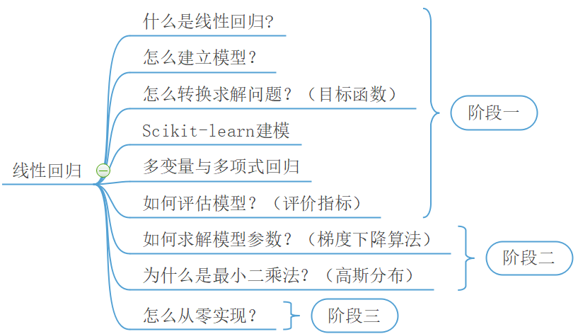

# 线性回归

## 0 学习路线

## 1 第一阶段

### 1.1 内容

- [线性回归（模型的建立与求解）](https://mp.weixin.qq.com/s/pSr5EFNK2Lu9CvRZnFCGKQ)

  - [示例1](./101_visualization.py)，[示例2](./102_train.py)

- [线性回归（多变量与多项式回归）](https://mp.weixin.qq.com/s/QqjCzRIRkOydlwAsvWWLyQ)
  - [示例1](./201_train.py)，[示例2](./202_train_pol.py)
- [线性回归（模型的评估）](https://mp.weixin.qq.com/s/Y4QMqv9EfdDDpQOo85y1aA)
  - [示例1](./301_visualization.py)，[示例2](302_metrics.py)，

### 1.2 练习

- 完成示例代码的运行
- 浏览sklearn官方文档
  - [sklearn API（官方）](https://scikit-learn.org/stable/modules/classes.html)
  - [sklearn API （中文社区）](https://sklearn.apachecn.org/)

## 2 第二阶段

### 2.1 内容

- [线性回归（梯度下降）](https://mp.weixin.qq.com/s/6Z4vcs_CtQYZxrU_JmSzqQ)

  - [示例1](401_visualization.py)，[示例2](402_init_weight.py)，[示例3](./403_gradient_descent.py)

### 2.2 练习

- 完成示例代码的运行并**理解**

## 3 第三阶段

### 3.1 内容

- [神说，要有正态分布，于是就有了正态分布](https://mp.weixin.qq.com/s/1DiBXYGRCXZgmmEADsLI-w)
- [线性回归（目标函数的推导）](https://mp.weixin.qq.com/s/gzMEjhRNCHRekg7BY3VoXA)
  - [示例1](./405_normal_distribution.py)，[示例2](./406_boston_house_prediction.py)

### 3.2 练习

- 完成示例代码的运行

  

### **[<主页>](../README.md)**    [<下一讲>](../02_LogisticRegression/README.md)

