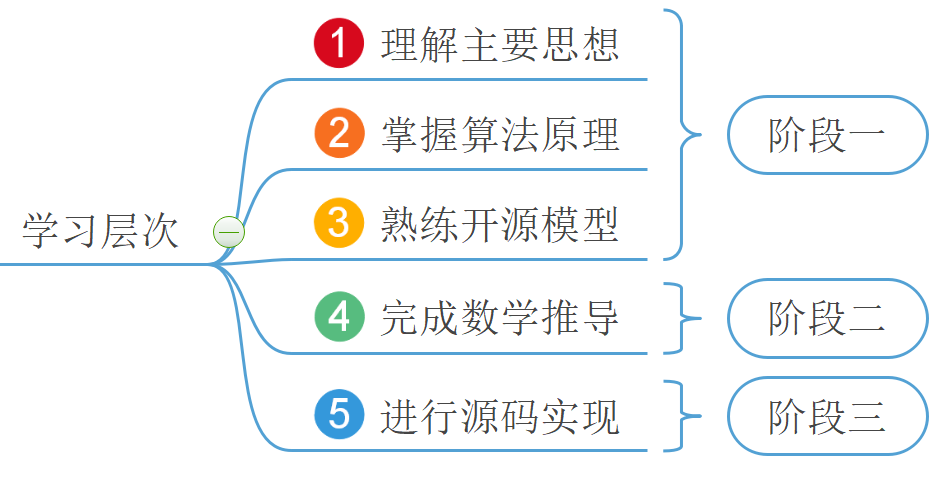
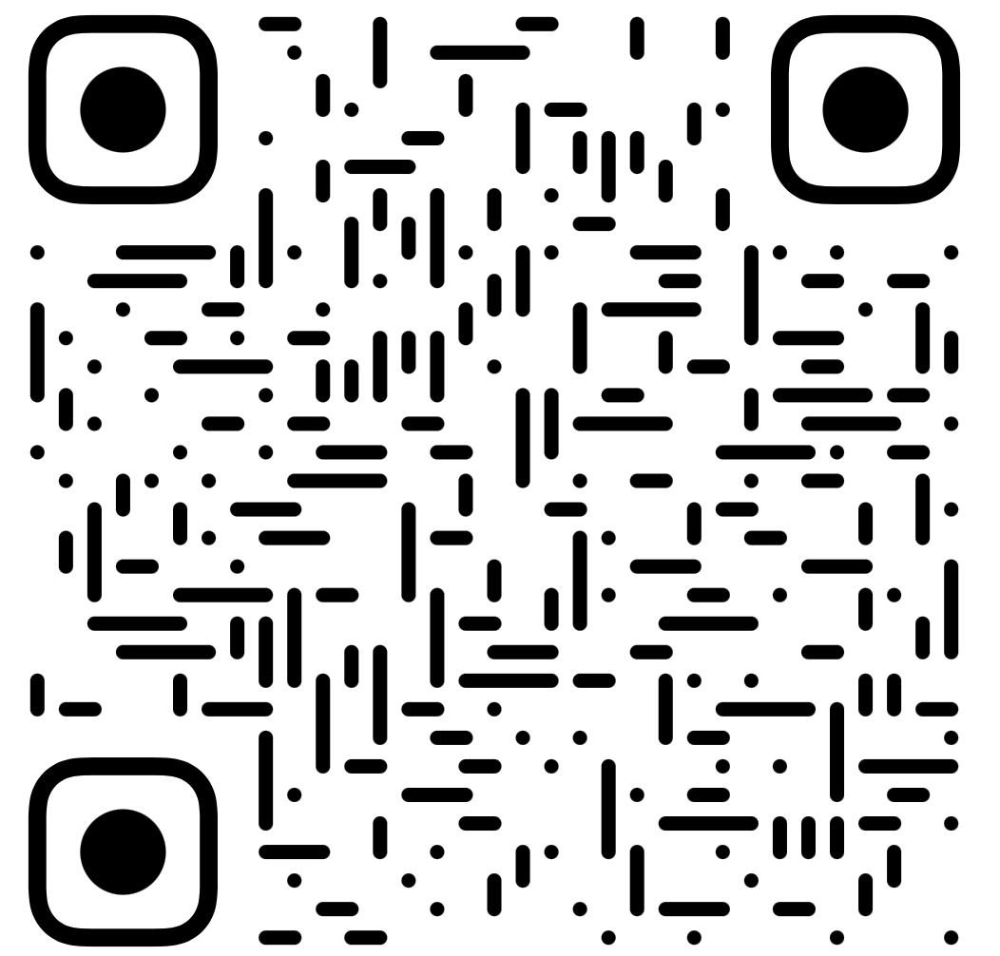

各位朋友大家好，欢迎来到月来客栈，我是掌柜空字符。

在知乎隔不了多久就会看到有人提问“如何才能入门机器学习”、“入门机器学习从理论开始还是从实践开始？”、“入门机器学习李航、周志华、吴恩达应该谁的资料最好？”等等诸如此类的问题。想想掌柜刚刚开始接触机器学习的时候又何尝不是这样，总觉得自己一直是在门外徘徊，就是不得其中之道。幸运的是经过漫长的时间摸索，也总结出了适合掌柜自己的一条学习路线，接下来就与大家一同分享。

### 1 什么是好方法？

好的方法事半功倍，差的方法事倍功半。当然，本质上来说**方法没有好坏之分，只有适合不适合的区别，适合自己的方法才能称之为好方法**。因此这也就回答了诸如“李航的统计学习方法，吴恩达的视频，关于机器学习的东西都看不懂是怎么回事？”这类的问题。

任何一本书都不可能做到让所有人都觉得“好”，这个“好”不是评价它的质量好坏与否，而是在于它适不适合自己。**适合自己的才算是“好”，不适合的都是“垃圾”**。同时，任何一本书基本也不可能做到每个知识点都讲得很好，对于你来说可能某本书就其中一个算法你认为讲的很好，而且特别适合自己，但是剩下来的自己都看不懂。可能学习10个算法别人一本书就够了，而自己却需要10本书，但哪怕就是这样的状况掌柜认为也是值得的。

所以，看不懂李航的没关系，看不懂吴恩达的也没关系，但是一定不要放弃去找一本适合自己的书、自己的视频。诚然，需要明白的是刚开始入门机器学习是有一定的门槛，所以也不要轻易放弃。同时，尤其需要说明的一点就是奖励的反馈机制，选择一种**阶梯式的、循序渐进式的**学习方法使得自己在学习一个算法中，每过一天半天的时间都能够有收获感、成就感、喜悦感，这样才能有更强的动力继续学下去形成正向反馈的闭环。

### 2 怎么进行学习？

掌柜第一次系统性的学习机器学习时所接触到的资料是吴恩达老师的机器学习视频课程。不得不说吴恩达老师的这门课程内容也确实浅显易懂，并且大部分内容也讲解得十分详细，对于初学者来说上课内容绝对是满满的干货。不过学着学着，掌柜慢慢地发现这门课似乎并不是那么的适合自己。由于当时掌柜也没有找到更好的学习材料，所以也只有硬着头皮接着往下看。直到第二次拿着李航老师的统计机器学习课本继续学习时，才总结出了一套适合掌柜自己的学习路线。总结起来就是一句话：**先抓主干，后抓枝节**。千万不要小瞧这八个字，很多朋友不能入门机器学习可能就是因为没人告诉自己这个道理。

学习一个算法就好比遍历一棵大树上的所有枝节，算法越是复杂枝叶也就越茂盛，且通常来说有两种方式来遍历这颗大树：**深度优先遍历和主干优先遍历（不怎么恰当）**。对于有的人来说可能适合第一种：从底部的根开始，每到一个枝干就深入遍历下去，然后再回到主干继续遍历第二个枝干，直到遍历结束；而对于有的人来说可能更适合第二种：从底部的根开始，沿着主干爬到树顶先对大树的整体结构有个概念，然后再从根部开始像第一种方法一样遍历整棵大树。相比于第一种方法，第二种方法在遍历过程中更不容易“迷路”，因为一开始我们就先对树的整体结构有了一个了解。

因此，对于一个算法的学习，掌柜自己将它归结成了五个层次（三个阶段）：

其中阶段一可以看成是先从大树主干爬上树顶一窥大树全貌的过程，因为对于一个算法来说，最基本就是它背后的思想，而这也是一个算法的灵魂所在；阶段二和阶段三就可以看成是遍历完整个大树后的层次，是对细枝末节具体的探索。

那为什么会是上面这个排序呢？可以打乱吗？掌柜的回答是：当然可以，只要是适合自己的方法，就是好方法。不过掌柜依旧强烈建议按照上述顺序来进行学习。**可遗憾的是现在绝大多数人（或资料）的学习顺序都是①②④⑤③或者是①②④③⑤**。这两种学习顺序的弊端就在于很多算法在数学推导中是有难度的（例如支持向量机），当克服不了这个难度时很多人就不会接着往下进行了。最后呈现的结果便是，既没有彻底弄清原理，又没有学会如何使用。相反，掌柜一贯主张的是：**先学会怎么用，再探究为什么**。

同时，可能有人会问①学了直接学③可以吗？掌柜的回答是：绝对不可以！因为这将使得你变成一个完全的调参侠，各种参数组合在你眼里都是盲目试出来了，你根本不明白每个参数背后的具体含义（过大怎么样，太小会如何），尽管这样也可以宣称自己会使用开源框架了。具体对应的学习步骤和阶段划分，掌柜会在文末给出的学习材料中进行详细论述。

### 3 学到什么时候？

对于一个算法到底应该学到什么样的程度同样也是初学者所面临的一个问题。就像是有人问：对于一篇论文，我到底是应该看懂原理就行，还是要尽可能的去实现？可以想象，如果没有事先将一个算法的学习过程归结为如上三个阶段，那么此时掌柜还真不知道如何告诉你应该学到哪儿。

这里，掌柜的建议是，对于所有的算法阶段一是必须完成的；对于一些基础或相对容易的算法（如线性回归、逻辑回归等）可以要求自己达到上述三个阶段；对于那些难度较大的算法（如SVM、决策树等）可以要求自己做到前两个阶段就行。同时，需要清楚地认识到的就是，对于任何一个算法的学习只有极少数人能做到学一遍就全懂的境界，因此也不要抱着学一次就结束的想法。例如第一次学达到阶段一、第二次学达到阶段二等等。这样分阶段的学习方式更能够相对容易的使自己获得满足感，以享受学习的乐趣。同时，照着以上步骤学习大约3-4个算法后，便可以算是初窥机器学习的门径了！

### 4 使用什么材料？

关于在学习中应该使用什么样的材料这个掌柜在上面已经说过，选择适合自己的材料就行。目前市面上比较流行的有（排序不分先后）：李航老师的《统计学习方法》书籍、周志华老师的《机器学习》书籍以及吴恩达老师、李宏毅老师、李沐老师的相关机器学习视频等。对于入门来说，大家可以都先去试看一部分内容看看哪位老师的讲解方式更容易被自己接受。或者粗暴一点，对于任意一个新的算法，上述老师的学习材料都可以去学习一遍，直到按照自己设定的目标完成当前阶段内容的学习。

最后，掌柜这里也推荐自己总结的机器学习笔记——《跟我一起学机器学习》。所有内容在编排过程中均以上述掌柜提到的五个层次三个阶段为导向，力争让大家做大先学会怎么用，再探究为什么。

所有内容持续更新中~

### 5 总结

对于整篇内容，掌柜这里用4句话进行总结，即：①方法没有好坏之分，只有适合不适合的区别，适合自己的方法才能称之为好方法；②选择一种阶梯式的、循序渐进式的学习方法，务必使得自己在学习中形成正向反馈的闭环；③在学习过程中要学会先抓主干，后抓枝节不要本末倒置；④遵循先学会怎么用，再探究为什么的学习原则。

本次内容就到此结束，感谢您的阅读！如果你觉得上述内容对你有所帮助欢迎点赞分享！若有任何疑问与建议，可留言进行交流。**青山不改，绿水长流，我们月来客栈见！**

扫码关注@月来客栈公众号获得更多优质内容！

