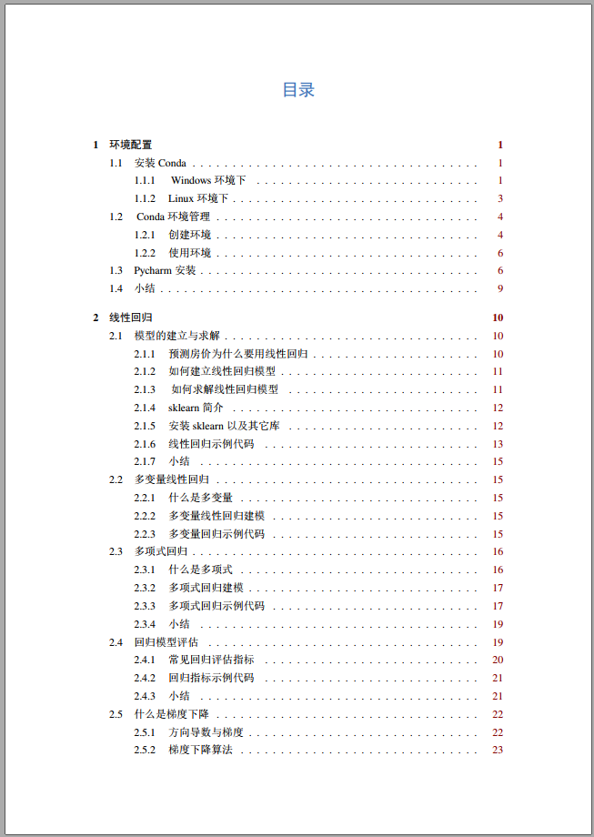
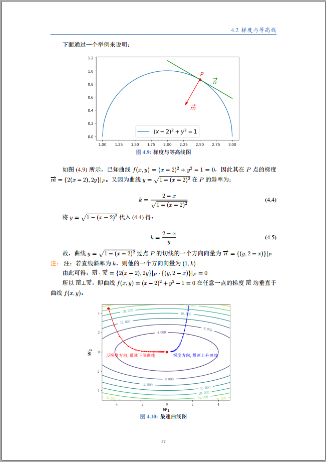
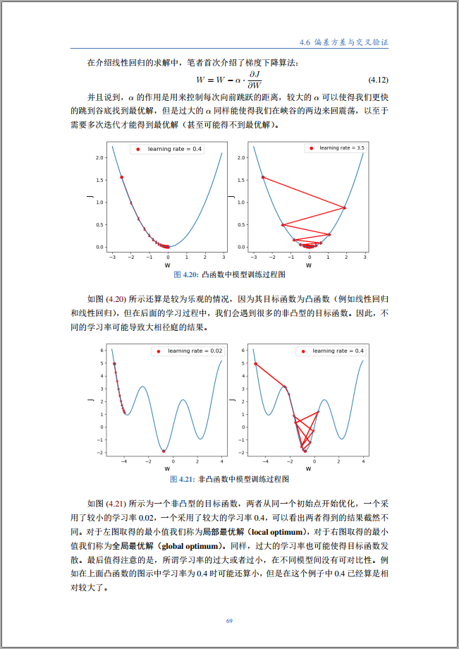
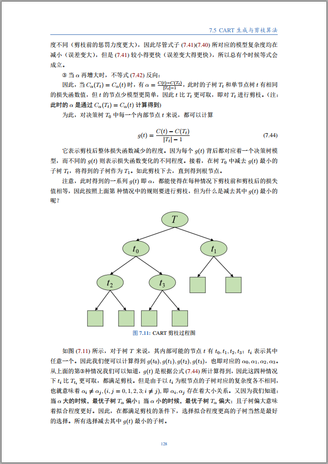
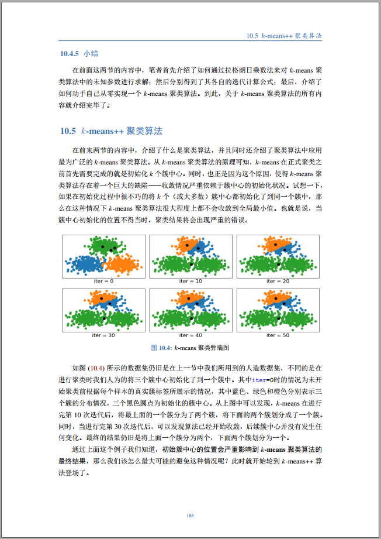

# MachineLearningWithMe

# 目录

### [第零讲：环境安装与配置](./00_Configuration/README.md)

### [第一讲：线性回归 ](./01_LinearRegression/README.md)

### [第二讲：逻辑回归](./02_LogisticRegression/README.md)

### [第三讲：模型的改善与泛化](./03_ModelOptimization/README.md)

### [第四讲：K最近邻与朴素贝叶斯](./04_KNNAndNaiveBayes/README.md)

### [第五讲：决策树与随机森林](./05_DecisionTree/README.md)

### [第六讲：支持向量机](./06_SupportVectorMachine/README.md)

### [第七讲：聚类](./07_Clustering/README.md)

### [知识点索引](./KnowledgeIndex.md)

历经近半个月的排版工作，[《跟我一起机器学习》](./《跟我一起机器学习》V_1.0.pdf)笔记总算是和大家见面了。这份笔记包含了笔者自接触机器学习以来记录的所有内容与思考，可谓是干货满满。现在笔者无偿的将这份笔记分享给各位有需要的朋友，希望你们在学习过程中能够尽量减少一些不必要的弯路。

### 为什么会有这份笔记

记得笔者大约是在三年前开始接触机器学习，也正是在那个时间附近件，笔者越发的认为“**要想学得好，笔记不能少**”。于是，在这之后笔者每每学完一个新的知识点都会选择将它记录下来。慢慢的，不知不觉就记录近200篇博客，内容从机器学习到深度学习、从编程语言到开源框架等，只要是接触过的笔者都会选择将它给记录下来。在记录的过程中，笔者都会将看到的各种资料以笔者自己的思维方式从头梳理一遍再形成笔记。这样做的好处就是能够使得这些知识点能够与自己脑中固有的知识结构更好的进行融合。

不过遗憾的是，对于大多数人来说，如果很久不触碰一个知识点也是非常容易遗忘的，尽管你可能也像笔者一样在学习它的时候做了系统的梳理。因此，这也就更加显得笔记的重要性了，有了这些笔记后哪怕是因为时间久遗忘了，我们也能够很容易的将它重拾起来。

在今年四月份的时候，笔者注册了一个名为“月来客栈”的公众号，用来分享与传播机器学习相关的知识内容。同时，为了提高这些推文的质量，笔者以原先的博客记录为蓝本又一次的从头梳理了这些内容，然后陆续开始进行了推送。大约是在十一月初，笔者在群里看到有朋友说，如果能将这些推文整理成一个文档就好了，因为在手机上看容易分神。为了满足这些朋友的需求，笔者又一次的对这些内容的组织结构进行了一次梳理与排版。今天，这份笔记的正式版也终于整理完毕了，它包含了超过十万字两百多页的内容，很大程度上的满足了对于初学者的需求。

不过尽管如此，这份笔记依旧有很多的不足之处：①有些章节的内容并不完整（如第8章的集成模型，第9章SVM最后的求解部分等）；②笔记中的实例较少，不能很好的满足大家的学习；③由于精力有限，现有的内容中肯定也存在一些未被发现的错误。因此，如果有小伙伴能够发现这些错误或者是愿意补充一些新的内容，请直接与笔者联系即可，笔者也会在后续的版本中进行更新。

### 笔记特色

从整理笔记的伊始，笔者都尽量选择了以直白的方式告诉大家每个算法的原理与思想。尽管看起来十分的口语化，但这却大大降低的学习的门槛，尤其是对于那些计算机专业的朋友。同时，对于一些重要而又难以理解的概念，笔者都会反复两至三次以不同的口吻来进行阐述。例如笔者在第3章中用了下面这么一段话来阐述为什么我们需要用到最大似然估计：

我们知道，在机器学习中都是通过给定训练集，即$x,y$来求得其中的未知参数$W,b$。换句话说，对于每个给定的$x^{(i)} $，我们已经知道了其所属的类别$y^{(i)}$，即**$y^{(i)}$的这样一个分布结果我们是知道的**。那么什么样的参数$W,b$能够使得已知的$y^{(1)},y^{(2)},\cdots,y^{(m)}$这样一个结果（分布）最容易出现呢？也就是说给定什么样的参数$W,b$，使得当输入$x^{(1)},x^{(2)},\cdots,x^{(m)}$这$m$个样本时，最能够产生已知类别标签$y^{(1)},y^{(2)},\cdots,y^{(m)}$这一结果（一定要好好理解这段话）。

尽管这段话看起来有些重复啰嗦，但只要你认真体会，一定会受益匪浅。下面是一些笔记的内容截图：

**邮箱：moon-hotel@hotmail.com  微信：nulls8  公众号：月来客栈**

